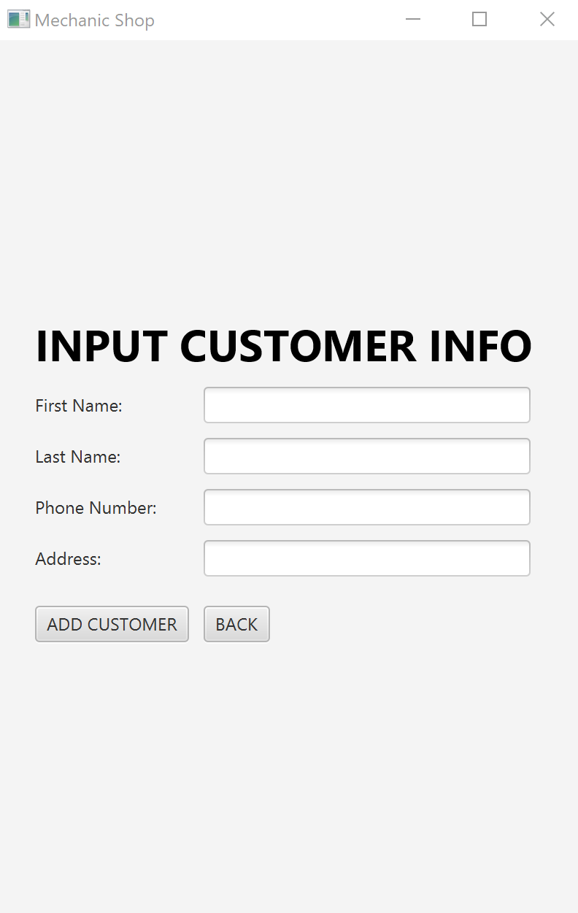
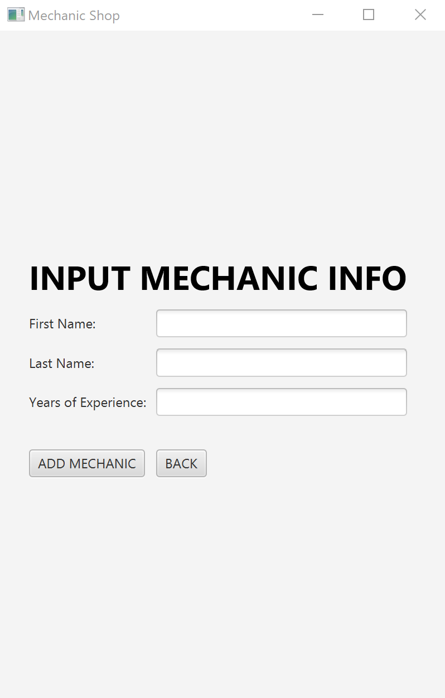
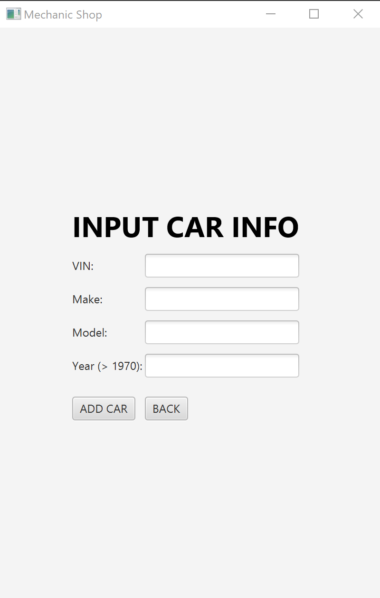
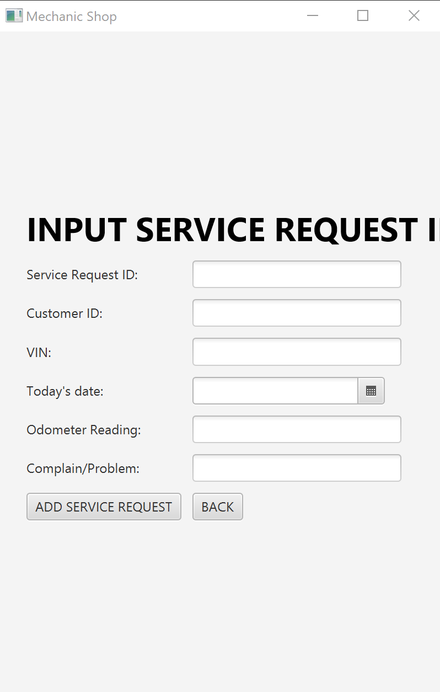
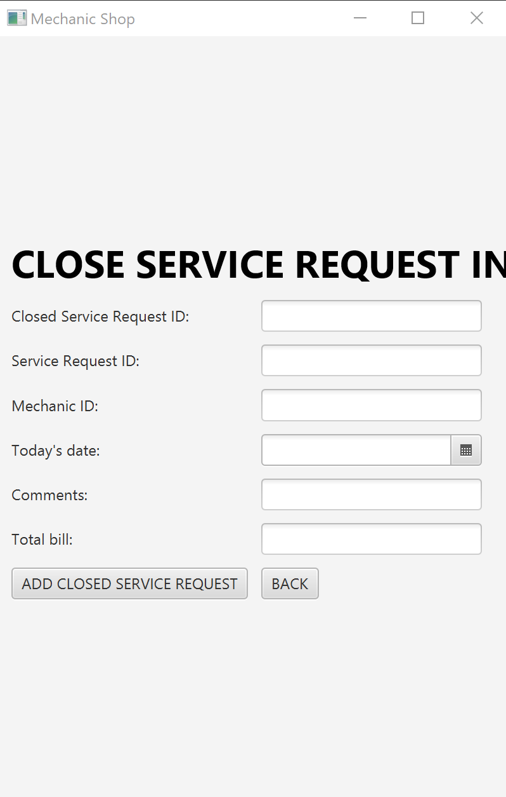
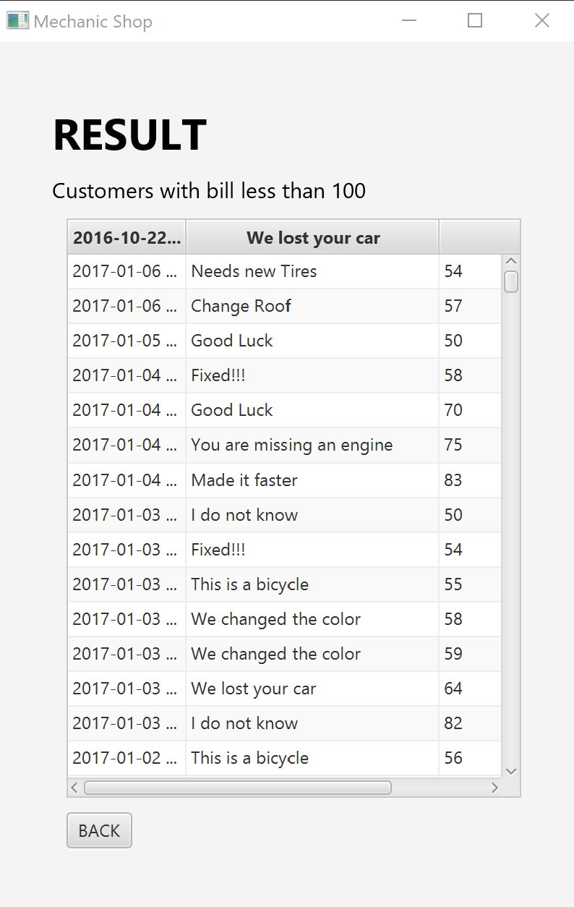
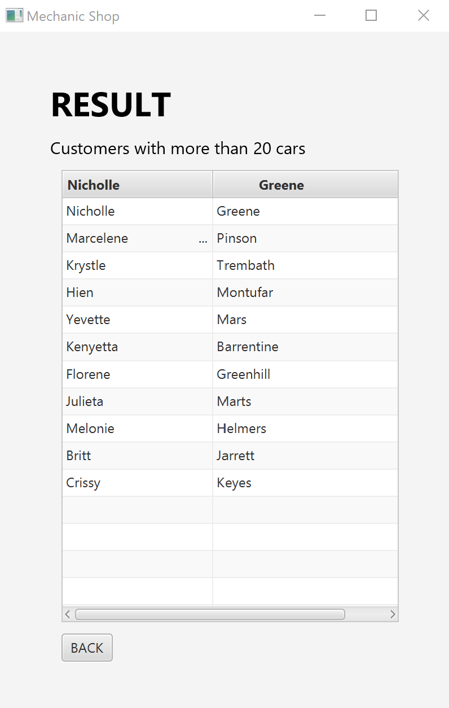
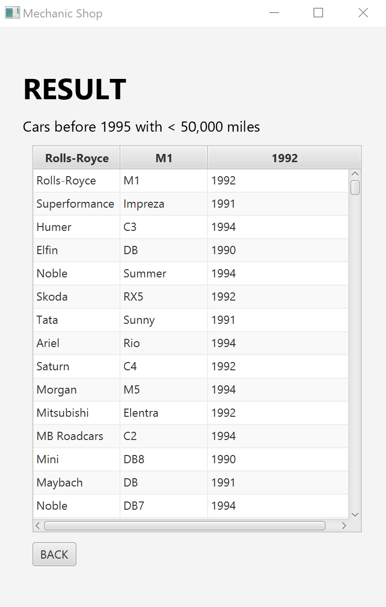
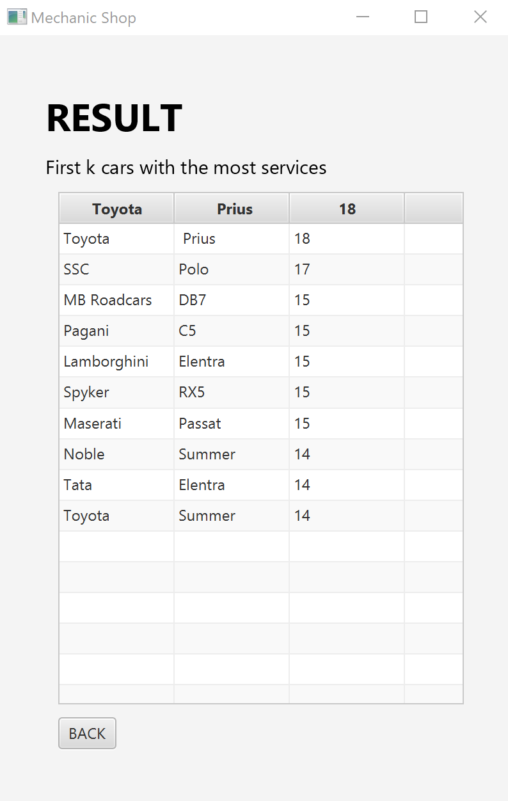
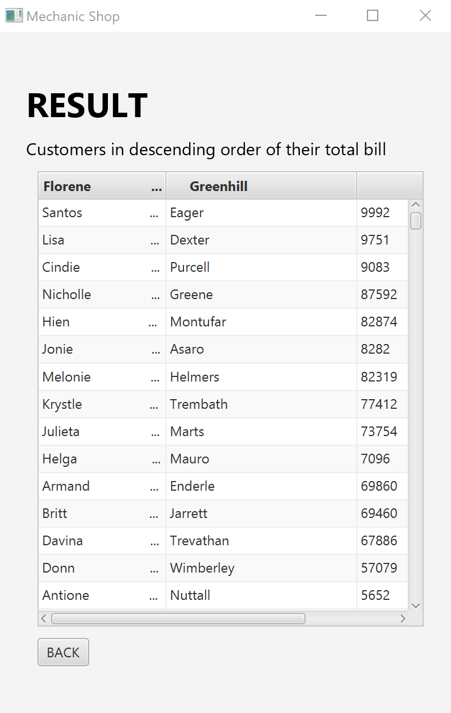

# Mechanic Shop DB Management

## Quick Start
1. Clone the repository into your system and make sure you have the standard JavaFX libraries. 
2. Either connect to a database or set up a local Postgres database. 
3. Change the path as needed of the create.sql script so that you can copy the provided CSV files. 
4. Run the create.sql script and App.java and an interface should appear in which you can interact with.

## Project Description
Develop a client application using Java and build a database for a mechanics shop. The system can
be used to support various queries and track information about customers, cars, mechanics, car ownership, service 
request and billing information.

Adding a Customer | Adding a Mechanic | Adding a Car
:----------------:|:-----------------:|:--------------:
To add a customer, simply click the 'ADD CUSTOMER' button and fill in the needed information. | To add a mechanic, simply click the 'ADD MECHANIC' button and fill in the needed information. | To add a car, simply click the 'ADD CAR' button and fill in the needed information.
 |  | 

Inserting a Service Request | Closing a Service Request
:--------------------------:|:--------------------------:
To insert a service request, simply click the 'INSERT SERVICE REQUEST' button and fill in the needed information. | To close a service request, simply click the 'CLOSE SERVICE REQUEST'' button and fill in the needed information.
 | 

### Various Queries
To run the various queries, simply click on the query you would like and, you should see the result in the form of a 
table. 

1 | 2 | 3 | 4 | 5 
:----:|:----:|:----:|:----:|:----:
 |  |  |  | 

## Approach
The Mechanic Shop DB Management system contains two parts: a database for data storage and a client application for 
database management. The client application also contains two parts: a database connection handler that interfaces with 
the mechanic shop database (MechanicShop.java), and a graphical user interface to interface with a mechanic shop user 
(App.java).

In order for users to manage the mechanic shop database, an instance of the DB connection handler is created within 
App.java when the app starts. This handler allows for inserting, removing, and querying from the database (see above) 
through the GUI.  
